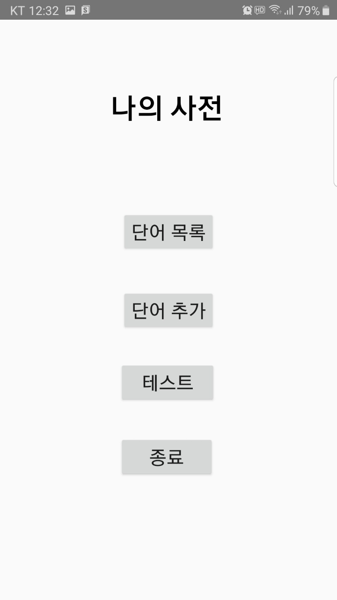
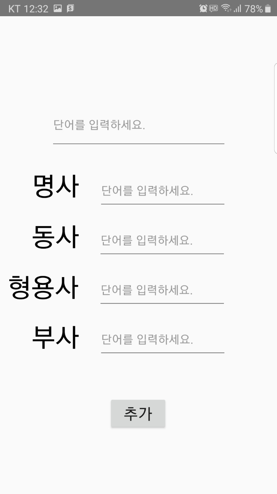
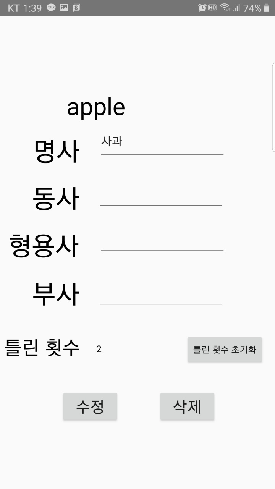
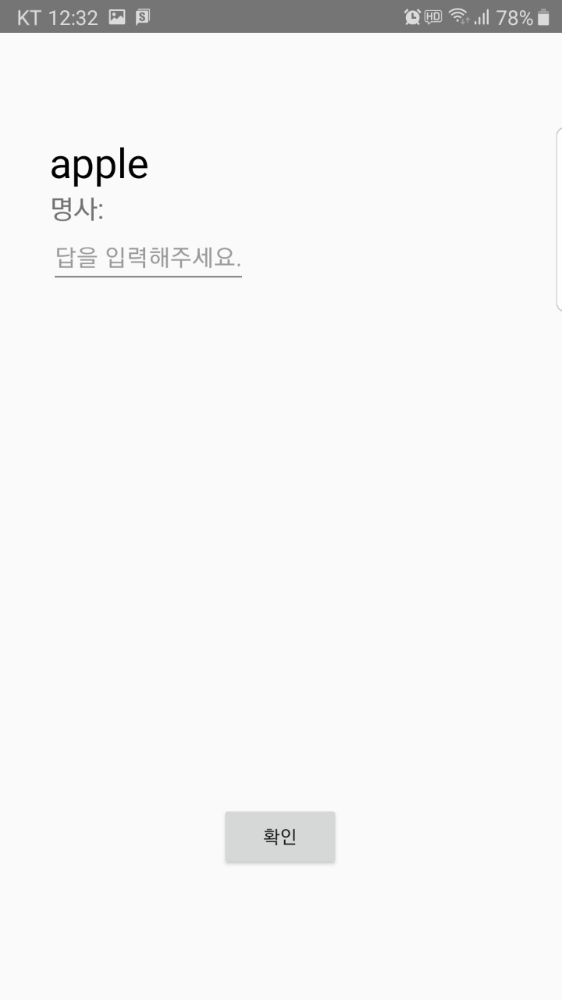
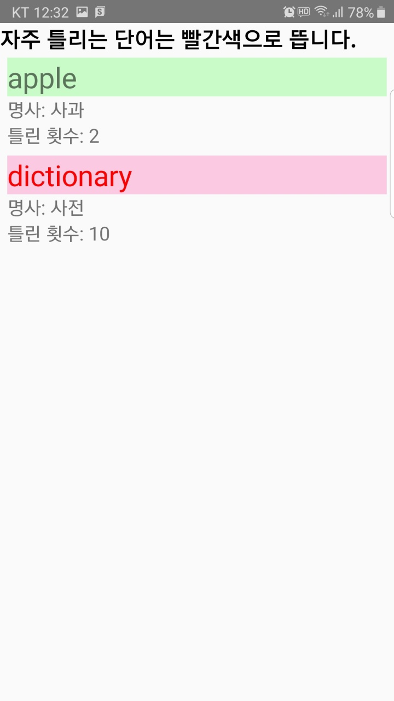
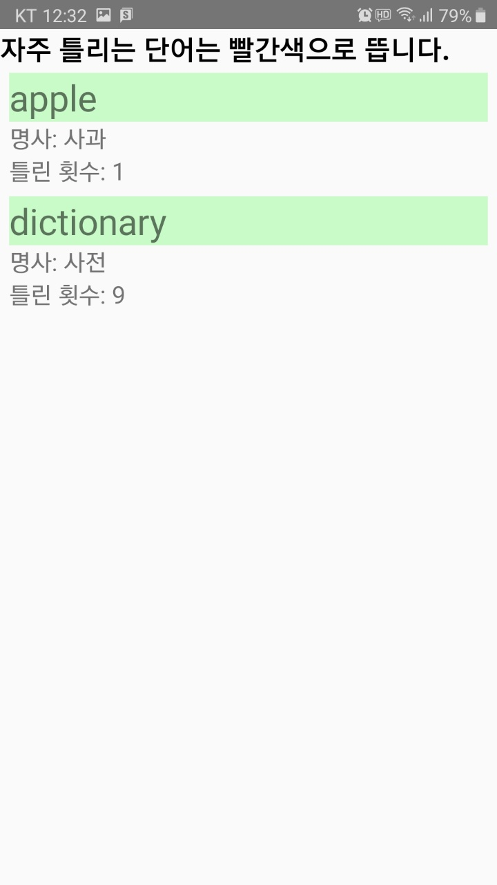

# MyDictionary

기존에 있는 단어사전 어플들은 다른 사전에 있는 사이트의 정의를 그대로 복사하여
불러오기 때문에 내가 필요한 부분만 알고 싶은 경우 가독성이 매우 떨어졌다. 
이를 개선하기 위해 내가 직접 원하는 단어들을 저장하고 또한 이를 제대로 암기했는지 확인하기 위해 테스트를 할 수 있는 어플을 개발하였다.

해당 어플은 영어 단어에 최적화 시켜 만들었다. 따라서 단어를 추가할 때 다양한 품사들을 넣을 수 있게 만들었다.

또한 테스트를 보고 난 후 일정 횟수 이상 틀린 경우 내 목록에서 빨간색으로 떠 해당 단어를 더욱 신경써서 숙지해야 함을 강조하였다.

## Preview

